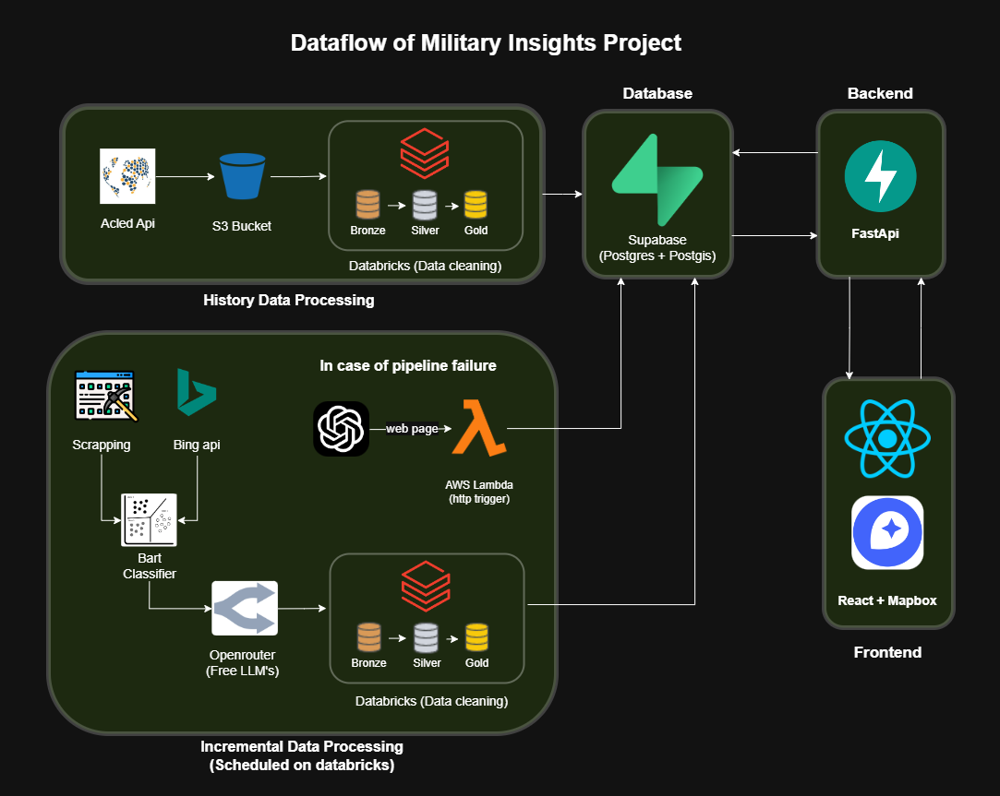
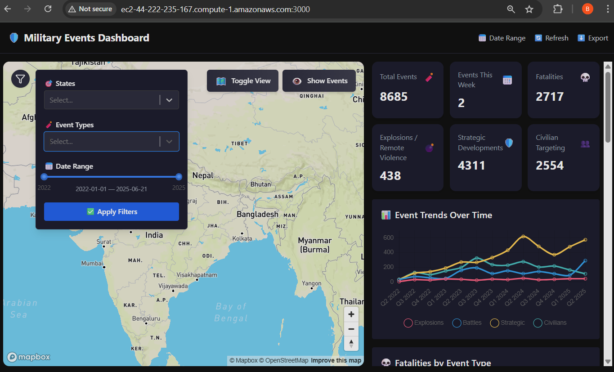
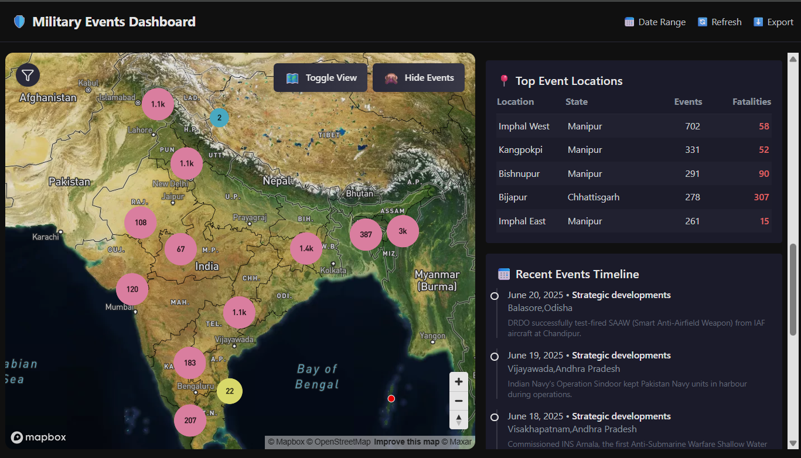
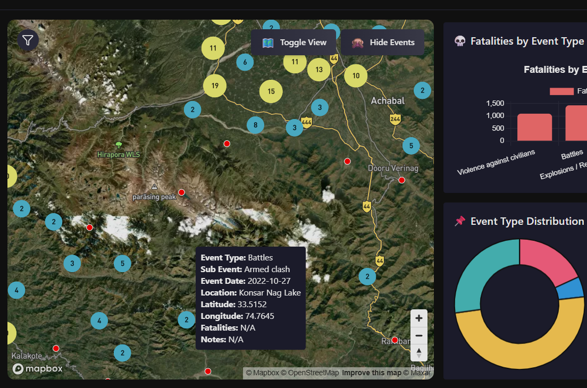

# 🛡️ Military Insights Project

An end-to-end data engineering and full-stack system designed to extract, process, and visualize defense-related events across India. This includes incidents like battles, strategic developments, explosions, and violence against civilians—based on open-source intelligence.

---

## 📌 Project Goals

- Aggregate historical and real-time military event data from public sources (e.g., ACLED, news).
- Clean and transform data using a medallion architecture (Bronze → Silver → Gold).
- Classify event types using LLMs.
- Store geospatially-aware data in a PostgreSQL + PostGIS database (via Supabase).
- Visualize military insights on an interactive India map with a modern frontend.
- Build scalable, cloud-native infrastructure with support for automation and fault recovery.

---

## 🧩 Tech Stack

### 🗃️ Data Sources
- **ACLED API** – For structured conflict event data.
- **Web Scraping** – From major news sites like *The Hindu*.
- **Bing Search API** – To supplement scraped content.

### 🧹 Data Processing
- **Databricks** (Bronze → Silver → Gold) – For cleaning and transformation.
- **BART Zero-Shot Classifier** – To tag events into 5 categories:
  - Explosions / Remote violence
  - Battles
  - Strategic developments
  - Violence against civilians
  - Other
- **OpenRouter** (Free LLMs) – For extracting data from articles.

### 🛢️ Storage
- **S3** – For storing raw files from ACLED and scrapers.
- **Supabase** (PostgreSQL + PostGIS) – Stores cleaned, classified, and geotagged data.

### 🖥️ Backend
- **FastAPI** – Serves data from Supabase via REST APIs to frontend clients.

### 🌐 Frontend
- **React + Mapbox** – Interactive India map with state-level drill-down and conflict zone visualizations.

### ⚙️ Automation & Failure Handling
- **Databricks Workflows** – Primary scheduler for both historical and incremental ingestion pipelines.
  - Runs daily data scraping, classification, and ingestion jobs.
  - Monitors task success/failure using Databricks job run status.

- **GitHub Actions** – Acts as a fallback scheduler only in case of Databricks pipeline failure.
  - Triggers emergency ingestion and classification pipeline.
  - Uses `cron`-based schedule and/or manual dispatch via GitHub UI.
  
- **AWS Lambda** – Handles reclassification logic via OpenRouter in case BART model fails or timeout occurs during pipeline.

---

## 📅 Workflow Breakdown

### 🔁 Incremental Ingestion
- Scheduled on Databricks daily.
- Scrapes news data.
- Classifies articles using BART and extracts data from article using OpenRouter LLM's.
- Cleans and structures data using medallion architecture.
- Loads final records into Supabase.

### 🗃️ Historical Data Processing
- One-time ingestion from ACLED API to S3.
- Cleaned and transformed via Databricks.
- Loaded into Supabase for frontend use.

### 🧯 Fallback (Pipeline Failure)
- **AWS Lambda** (HTTP trigger) initiates fallback classification using LLMs.
- **GitHub Actions** – Runs the ingestion pipeline if Databricks workflow fails or misses a scheduled run.

---

## 🗺️ Visual Dashboard

Frontend is hosted on a modern stack (React + Mapbox) that enables:
- Interactive state-wise exploration.
- Conflict zone mapping.
- Timeline filtering.
- Categorization toggle based on event type.

---

### 📸 Screenshots

---

## 🧠 Future Scope

- Real-time alerting system

- Predictive modeling for conflict hotspots

- RBAC and audit trail for secure access

---

### 🧾 License
This project is licensed under the MIT License.
